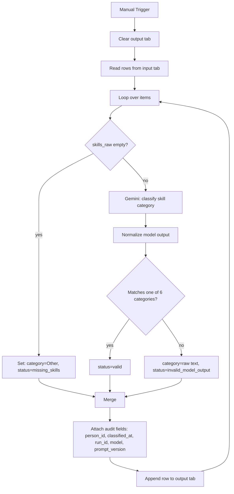

# Task 2 — Skill Category Auto-Tagger (n8n)

An n8n workflow that reads people from Task 1's merged output, uses an LLM (Gemini) to classify each person's skill set into one of six fixed categories, and writes the tagged result back to a Google Sheet — with full audit metadata and no duplicate rows on rerun.

## What it does

- Reads person records (`person_id`, `display_name`, `skills_raw`, `city`, `source_count`) from a Google Sheet populated from Task 1's `persons_merged.csv`
- For each person, classifies their combined skills into one of: **Web Development**, **Data / Analytics**, **Automation / AI**, **Design**, **Sales / Ops / Support**, or **Other**
- Validates the LLM's output against the fixed category list — anything that doesn't match exactly is flagged rather than silently accepted or coerced
- Handles people with no skill data at all without calling the model
- Clears the output tab before every run, so re-running the workflow never produces duplicate rows
- Writes each result back with audit fields: classification status, timestamp, run ID, model name, prompt version

## Setup

1. In Google Sheets, create two tabs in the same spreadsheet:
   - **`ConsultBae_Persons`** (input) — columns: `person_id, display_name, skills_raw, city, source_count`, populated from Task 1's `persons_merged.csv`
   - **`ConsultBae_Persons_Tagged`** (output) — columns: `person_id, display_name, skills_raw, skill_category, classification_status, classified_at, workflow_run_id, model_name, prompt_version`
2. Import `task2_flow.json` into n8n (Workflows → Import from File).
3. Connect your Google Sheets credential and your Gemini API credential to the respective nodes.
4. Point the Read/Clear/Append nodes at your spreadsheet ID and the two tab names above.
5. Run via the Manual Trigger node.

## How it works



## Key decisions

- **Fixed input/output schema.** Column names are locked (`person_id, display_name, skills_raw, city, source_count`) regardless of what Task 1's CSV originally called them, so the workflow never depends on informal naming.
- **`skills_raw` is pre-merged across sources.** It comes from Task 1's `persons_merged.csv`, which already combines a person's skills across all files they appear in — Task 2 assumes this is done, not something it does itself.
- **No blind trust in LLM output.** The model's response is normalized and checked against the exact list of 6 allowed categories. A non-matching response is stored as-is under `invalid_model_output`, not silently defaulted to `Other` — so bad outputs stay visible and auditable.
- **Empty skill data skips the model entirely.** An `IF` node checks for empty `skills_raw` before the Gemini call and deterministically assigns `Other` / `missing_skills` — avoids wasting a model call on data that can't be classified anyway.
- **Clean rebuild on every run.** The output tab is cleared before classification starts, so rerunning the workflow never leaves stale or duplicate rows from a previous run.
- **Full audit trail.** Every row carries `classified_at`, `workflow_run_id`, `model_name`, and `prompt_version`, so any run's results can be traced back to exactly how they were produced.
- **Google Sheets is the input/output adapter, not a file-ingestion pipeline.** The sheet is populated once, manually, from Task 1's export — this workflow classifies what's in the sheet, it doesn't watch for or ingest new files.
- **LLM chosen for practicality, not superior accuracy.** Gemini is used as a constrained classification step (fixed categories, single-word output) — this is a pragmatic use of an LLM for a fuzzy categorization task, not a claim that it outperforms a rules-based classifier.

## Files

```
task2_automation/
├── task2_flow.json     # exported n8n workflow
└── README.md
```

## Known limitations

- Category boundaries can be ambiguous for people with a broad skill mix — the prompt asks the model to pick the *dominant* theme, but this is inherently judgment-based.
- Classification quality depends on Gemini's output; `invalid_model_output` rows need manual review rather than being auto-corrected.
- This is a one-shot classification run, not a live pipeline — new people need to be re-added to the input sheet and the workflow re-run manually.